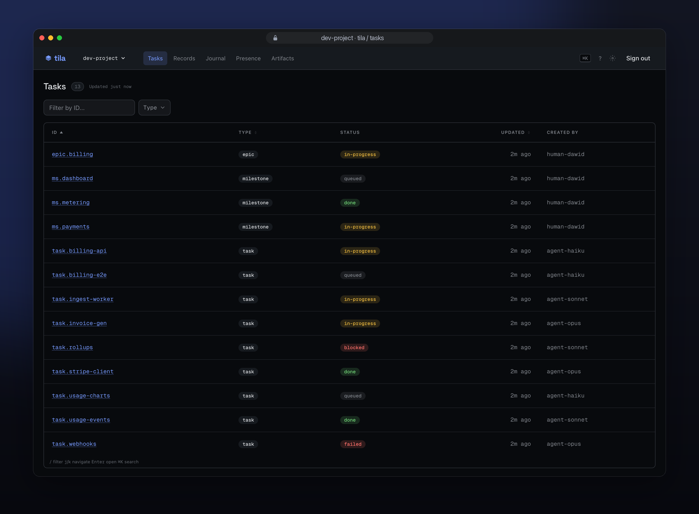

<div align="center">

# tila

**Durable state and artifact storage for multi-machine agentic work.**

Content-addressed artifacts outside your git repo. Schema-validated records.<br>
Coordination primitives that prevent races.

Deploy to your own Cloudflare account, or run locally with zero infrastructure.

> **Status:** v0.2.0 released. APIs are stable enough to build against; expect breaking changes before v1.0.

</div>

**For:** framework authors, AI autopilot builders, and small teams (3 to 6 engineers) whose agents need shared state across multiple machines.

---

## Contents

- [Why tila exists](#-why-tila-exists)
- [What it looks like](#-what-it-looks-like)
- [Self-hosted](#-self-hosted)
- [When you need tila](#-when-you-need-tila)
- [Quick start](#-quick-start)
- [For AI coding agents](#for-ai-coding-agents)
- [Monorepo packages](#-monorepo-packages)
- [Related projects](#-related-projects)
- [Contributing](#contributing)
- [FAQ](#-faq)

---

## 🪨 Why tila exists

Agent-produced artifacts (plans, designs, analysis reports, build outputs) pile up fast. Commit them to your repo and they rot in context: coding agents waste tokens parsing stale intermediate files, and your git history fills with noise no human reviews. Gitignore them and they vanish on clone, can't be shared across machines, and agents lose access on context switch. A separate repo just moves the problem.

Once you solve "where do artifacts go," the next question is shared state. Agents reading and writing pipeline configs, service catalogs, or feature flags need that state to be typed, validated, and protected from concurrent writes, not scattered across ad-hoc JSON files.

tila handles both. Artifact storage is content-addressed with deduplication, lifecycle, and full-text search. Every record write is schema-validated and revision-tracked. Coordination uses first-writer-wins fencing; stale writes get a 409, not silent overwrites. Not a SaaS. You deploy to your own Cloudflare account or run locally.

---

## 🔬 What it looks like

<p align="center">
  
  <br>
  <sub>The read-only dashboard: a fleet of agents coordinating on shared state — task hierarchy, live status, and per-agent ownership.</sub>
</p>

### Content-addressed artifacts: immutable and deduplicated

```bash
$ tila artifact put plan.md --kind=plan --resource=T-142 --fence=1
# => Uploaded artifact: produced/T-142/a7f3b2c1d4e5.md (238 bytes, sha256=a7f3b2c1)

$ tila artifact put plan.md --kind=plan --resource=T-142 --fence=1
# => Deduplicated: same sha256, no upload needed

$ tila artifact search "auth migration"
# => 3 results across 2 resources
```

Artifacts are keyed by sha256. Upload the same content twice and it's stored once. Full-text search across indexed content. Worker and doctor paths handle cross-store reconciliation; retention behavior is still evolving during v0.1.

### Typed records: structured state, not ad-hoc JSON

```bash
# Declare record types in tila.schema.toml, then read and write them:
$ tila record set service api ./api.yaml
# => Created record service:api  revision=1  fence=1

$ tila record get service api
# => { "version": "2.3.1", "owner": "platform", "deploy_target": "prod-us" }

$ tila record patch service api --json '{"owner":"infra"}' --fence=1
# => Updated record service:api  revision=2  fence=2

$ tila record history service api
# => r2  2026-05-16T10:35  patch  {owner: "platform" → "infra"}
# => r1  2026-05-16T10:34  set    (initial)
```

Every write is schema-validated. Every mutation requires a fencing token. Every change is revision-tracked.

### Coordination: claims, gates, and fencing tokens

```
Agent A                                Agent B
───────────────────────────────────   ───────────────────────────────────
$ tila task claim T-142                $ tila task claim T-142
=> fence=42                            => 409 already-held by agent-a

$ tila artifact put plan.md \          (waits for A to release)
    --resource=T-142 --fence=42
=> ok                                  $ tila task claim T-142
                                       => fence=43
```

First-writer-wins with monotonic fences. Stale writes to tila-managed state get a 409 instead of silently overwriting newer work. Gates block ready-set selection until external requirements are resolved.

### Core concepts

- **Journal** — append-only audit log of every state transition (who changed what, when, with which fence)
- **Signals** — lightweight inter-agent notifications distinct from journal events
- **Presence** — TTL'd machine activity tracking across connected agents
- **Schema evolution** — tolerant reads, validated writes, diffSchemas for migration tracking
- **Records** — typed mutable JSON with optional R2 snapshots for point-in-time recovery

---

## 🏠 Self-hosted

tila deploys to your own Cloudflare account (Worker + DO + D1 + R2). There is no tila-hosted control plane for your project data.

- **$5/month Cloudflare paid plan covers most small teams.** Worker, Durable Object, D1, and R2 with included quotas
- **Free tier works for evaluation and light usage.** The 10ms CPU-per-request limit constrains sustained workloads
- **Local mode.** `tila init --local` stores everything in `~/.tila/` via bun:sqlite. No account needed. Core task, claim, and presence workflows work locally; full CLI parity is still in progress
- **No per-seat pricing.** Costs are Cloudflare usage costs in your account
- **Smart Placement** is enabled by default on the Cloudflare path. Both paths share `@tila/ops-sqlite` for entity, coordination, artifact, journal, gate, and signal logic

---

## 🧩 When you need tila

- Your agents produce artifacts (plans, reports, build outputs) that don't belong in git but need to be durable, searchable, and accessible across machines
- Your agents share typed state (pipeline configs, service catalogs, agent policies, feature flags) and you want schema validation, revision history, and an audit log
- Multiple agents on multiple machines need coordination for shared resources before write time
- You want approval gates that keep blocked work out of the ready set
- You've outgrown "one developer, one laptop, git is enough" but don't want to operate Postgres or Temporal

---

## 🤝 Related projects

These projects solve adjacent problems and work well alongside tila:

| Project | What it does well | Relationship to tila |
|---------|-------------------|---------------------|
| [beads](https://github.com/gastownhall/beads) | Dolt-powered distributed issue tracker with agent memory, dependency graphs, context compaction, and cross-machine sync | Different layers. Beads tracks what agents should work on and remember; tila stores shared typed state and artifacts |
| [claude-task-master](https://github.com/eyaltoledano/claude-task-master) | PRD-to-task decomposition with dependency graphs and complexity analysis | Good pairing. Task-master plans the work; tila is the state plane underneath |
| [ccpm](https://github.com/automazeio/ccpm) | GitHub Issues as coordination hub with automatic worktree isolation | Great choice when GitHub is already your team's project hub |
| [claude-mem](https://github.com/thedotmack/claude-mem) | Semantic memory with vector search across agent sessions | Different concerns. Memory and coordination don't overlap much |
| [mcp_agent_mail](https://github.com/Dicklesworthstone/mcp_agent_mail) | Async agent-to-agent messaging with searchable, threaded conversations | Different layers. Messaging between agents; tila is shared state for agents |
| [aweb](https://github.com/awebai/aweb) | Agent messaging, task management, and file reservations in one surface | Some overlap. aweb bundles several concerns; tila focuses on typed state and fence-checked writes |

**If you have one developer, one machine, and one agent at a time,** you probably don't need tila yet. Any of the tools above might be a better starting point. tila earns its keep when multiple agents might write to the same resource.

---

## For AI coding agents

The `tila-mcp-server` and `tila-sdk` packages are published on npm (current: v0.2.0). The MCP Registry id is `io.github.davebream/tila` (see the [MCP Registry](https://registry.modelcontextprotocol.io)). Three ways to connect:

**1. One command** (auto-detects your editor)
```sh
tila mcp init
```

**2. Manual config**
`.mcp.json` (Claude Code): `{ "mcpServers": { "tila": { "command": "npx", "args": ["-y", "tila-mcp-server"] } } }`
`.cursor/mcp.json` (Cursor) — same shape. `.vscode/mcp.json` (VS Code) — use `"servers"` instead of `"mcpServers"`.

> If your project uses GitHub auth (`[auth] mode = "github-repo"` in `.tila/config.toml`), no `TILA_API_TOKEN` is needed — the server reads credentials automatically. For token-based auth, add `"env": { "TILA_API_TOKEN": "<token>" }` to the config above.

**3. TypeScript SDK**
```sh
npm install tila-sdk
```

Full setup (auth modes, env vars, resources): [`packages/mcp-server/README.md`](packages/mcp-server/README.md)

---

## 📥 Installation

The CLI is published on npm as `tila-cli` (the unscoped `tila` name is taken by an
unrelated project, so it is not used for this CLI). Install it globally:

```bash
npm install -g tila-cli
```

Distribution channels:

| Method | Command | Status |
|--------|---------|--------|
| npm | `npm install -g tila-cli` | ✅ Available (v0.2.0) |
| curl (Unix) | `curl -fsSL https://github.com/davebream/tila/releases/latest/download/install.sh \| sh` | Release assets pending |
| PowerShell (Windows) | `irm https://github.com/davebream/tila/releases/latest/download/install.ps1 \| iex` | Release assets pending |
| Homebrew | `brew install davebream/tap/tila` | Tap pending |

**Run from source (for development):**

```bash
git clone https://github.com/davebream/tila.git
cd tila
pnpm install
pnpm --filter tila-cli dev -- --help
```

Use `pnpm --filter tila-cli dev -- <command>` in place of `tila <command>` when
working from a source checkout.

---

## 🏁 Quick start

### Cloudflare path

```bash
tila init --cloudflare          # provision Worker + DO + D1 + R2
tila task new "Migrate auth"    # create a work unit
tila task claim T-abc123        # acquire a fencing token
tila artifact put plan.md --kind=plan --resource=T-abc123 --fence=1
tila artifact search "auth"     # full-text search across artifacts
```

> GitHub auth is configured automatically during `tila init --cloudflare`. Teammates join via `tila init --inherit` — no shared API token needed.

### Local path

```bash
tila init --local               # no Cloudflare account needed
tila record set service api ./api.yaml
tila task new "Migrate auth"
# State lives in ~/.tila/<org>/<project>.db, artifacts in ~/.tila/artifacts/
```

See [What it looks like](#-what-it-looks-like) for detailed usage examples with output.

---

## 📄 Documentation

- [CLI Reference](packages/cli/README.md): all commands and workflows
- [MCP Server](packages/mcp-server/README.md): 41 tools, auth modes, resources
- [TypeScript SDK](packages/sdk/README.md): client API, claims, artifacts, error handling
- [Getting Started Tutorial](docs/tutorial-getting-started.md): from `tila init` to the UI dashboard
- [Architecture](docs/02-ARCHITECTURE.md): full technical spec
- [Roadmap](docs/03-ROADMAP.md): what v0.1 ships and what is deferred
- [Persistence Schema](docs/04-PERSISTENCE-SCHEMA.md): DO SQLite, D1, and R2 layouts
- [Operations](docs/05-OPERATIONS.md): deployment, monitoring, maintenance
- [Search](docs/06-SEARCH.md): searchable artifact kinds and FTS5 usage
- [GitHub-scoped Auth](docs/07-GITHUB-SCOPED-AUTH.md): GitHub auth (default) and repo allowlist
- [Records](docs/08-RECORDS.md): typed mutable JSON state primitive
- [Shared-Project Coexistence](docs/09-SHARED-PROJECT-COEXISTENCE.md): sharing one project across a framework and direct use

---

## 📦 Monorepo packages

| Package | Description |
|---|---|
| `@tila/schemas` | Zod schemas, canonical JSON helpers, no runtime deps |
| `@tila/core` | Backend interfaces, fence logic, schema evolution |
| `@tila/ops-sqlite` | Shared SQLite operations (entity, coord, artifact, journal, gate, signal, sweep) |
| `@tila/backend-d1` | D1 backend (auth tokens, sessions, idempotency, repo allowlist) |
| `@tila/backend-do` | Durable Object SQLite backend (Cloudflare path) |
| `@tila/backend-local` | bun:sqlite plus filesystem backend (local path) |
| `@tila/backend-r2` | R2 artifact backend (content-addressed blobs) |
| `@tila/worker` | Cloudflare Worker (Hono routing, Smart Placement) |
| `@tila/ui` | Read-only SPA served by the Worker |
| `tila-cli` | `tila` CLI binary (Bun-compiled) |
| `tila-sdk` | Typed TypeScript client for framework consumers |
| `tila-mcp-server` | MCP server exposing tila as tools and opt-in resources |
| `@tila/integration-tests` | End-to-end tests via `@cloudflare/vitest-pool-workers` |

---

## 🛠 Development

```bash
pnpm install
pnpm dev:setup                  # Generates dev config, applies D1 migrations, seeds project + token
pnpm dev                        # Start Worker on :8787
pnpm --filter @tila/ui dev      # Start UI on :5173 (separate terminal)
bash scripts/dev-seed.sh        # Populate with sample data (entities, claims, presence, artifacts)
pnpm test                       # Run test suite
pnpm typecheck                  # TypeScript type checking
pnpm check                      # Biome lint and format check
pnpm build                      # Production build
```

`dev:setup` is idempotent: re-running clears local state and reapplies from scratch. `dev-seed.sh` requires the Worker to be running.

---

## Contributing

Contributions are welcome. See [CONTRIBUTING.md](CONTRIBUTING.md) for development setup, commit conventions, and PR guidelines.

---

## 💬 FAQ

<details>
<summary><b>Is tila a hosted service?</b></summary>

No. See [Self-hosted](#-self-hosted).
</details>

<details>
<summary><b>Why Cloudflare and not Postgres?</b></summary>

Serializable per-project state, geographic edge placement, and zero ops starting at $5/month. Postgres is excellent but requires you to operate it.
</details>

<details>
<summary><b>Can I use tila without a Cloudflare account?</b></summary>

Yes. `tila init --local` — see [Self-hosted](#-self-hosted) for details.
</details>

<details>
<summary><b>How does this compare to LangGraph or CrewAI?</b></summary>

Those are agent orchestration frameworks. They run agents and route messages between them. tila is the state and coordination layer underneath such a framework. You can use LangGraph or CrewAI for orchestration and tila for typed state, artifact storage, claims, and gates.
</details>

<details>
<summary><b>How does this compare to beads?</b></summary>

Beads is a Dolt-powered distributed issue tracker with agent memory, dependency graphs, context compaction, and cross-machine sync via Dolt remotes. Great for giving coding agents structured task awareness. tila is a state and artifact engine with typed records, content-addressed storage, schema validation, and fence-protected writes. They sit at different layers: Beads tracks what agents should work on and remember, tila stores shared typed state and artifacts.
</details>

<details>
<summary><b>Why full-text search and not a vector database?</b></summary>

tila's search is keyword retrieval: "find the auth migration plan," not "find documents conceptually related to authentication." FTS5 handles this inside DO SQLite with BM25 ranking, phrase and prefix queries, sub-millisecond latency, and transactional consistency with artifact writes, all with zero additional infrastructure. Vector search is the right tool when you need semantic similarity over large corpora with unpredictable terminology, but it requires an embedding model, a vector store, and an embedding pipeline. Those are three new dependencies that conflict with tila's zero-ops design. If your workflow needs semantic search over tila artifacts, a consuming framework can maintain its own vector index via the artifact API.
</details>

<details>
<summary><b>What happens if I lose my Cloudflare account?</b></summary>

Your Cloudflare account holds the durable state. Backups are your responsibility. Durable Object SQLite supports point-in-time recovery; R2 supports lifecycle rules. The v0.2 roadmap adds explicit export and backup commands.
</details>

<details>
<summary><b>Is this stable?</b></summary>

v0.2.0 is released and tagged. APIs are stable enough to build against, but expect breaking changes before v1.0. Pin to specific versions.
</details>

<details>
<summary><b>What license?</b></summary>

MIT.
</details>

---

## License

MIT
