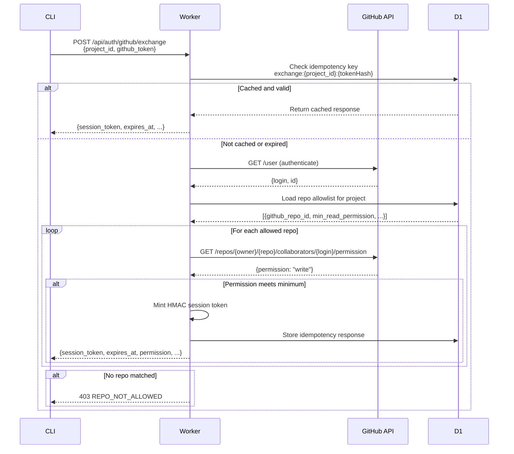

# Auth Implementation Documentation

**Status:** As-built documentation (2026-05-20)  
**Note:** File paths and line numbers reference the implementation state as of this document's date.

## 1. Overview

tila implements a unified authentication system with three distinct auth paths, all converging to a discriminated union type `UnifiedTokenResult` (defined in `packages/worker/src/types.ts` lines 16-49).

### Three Auth Paths

1. **D1 API Tokens** — Traditional bearer tokens, hashed and stored in D1. Used by CLI and SDK clients that provision long-lived credentials.
2. **GitHub Session Tokens** — HMAC-signed, short-lived (1 hour) session tokens scoped to GitHub repository access. Used by CLI clients in `github-repo` auth mode.
3. **Cookie Sessions** — HttpOnly session cookies for browser-based UI access. Backed by D1 session store.

### When Each Path is Used

| Auth Path | Client | Use Case | Lifetime | Revocation |
|-----------|--------|----------|----------|------------|
| D1 API Token | CLI, SDK, MCP | Long-lived machine access | Indefinite (until revoked) | Explicit (via `/api/tokens/:tokenId` DELETE) |
| GitHub Session Token | CLI (github-repo mode) | Repo-scoped collaboration | 1 hour | Automatic (expiry only, no explicit revoke) |
| Cookie Session | Browser UI | Interactive web access | 8 hours | Explicit (via `/auth/session/logout` POST) |

### UnifiedTokenResult Discriminated Union

All three paths resolve to a `UnifiedTokenResult` with `kind` discriminant:

```typescript
// packages/worker/src/types.ts lines 16-49
export type UnifiedTokenResult =
  | D1TokenResult       // kind: "d1-token"
  | SessionTokenResult  // kind: "session"
  | CookieSessionTokenResult // kind: "cookie-session"
```

Each variant includes:
- `projectId: string` — the project this token grants access to
- `name: string` — actor identity (token name or GitHub login)
- `scopes: string` — permission scope ("full" for D1 tokens, "full" for cookie sessions)
- `tokenId: string` — unique token identifier (empty string for cookie sessions)

Session tokens additionally include:
- `githubRepoId: number`
- `githubLogin: string`
- `permission: string` — normalized GitHub permission level ("read", "write", "admin")
- `expiresAt: number` — Unix timestamp (seconds)

Cookie sessions additionally include:
- `sessionHash: string` — hashed session UUID
- `expiresAt: number` — Unix timestamp (milliseconds)

## 2. Auth Path 1: D1 API Tokens

### Bearer Flow

1. Client sends `Authorization: Bearer <token>` header
2. Middleware hashes token with SHA-256 (`packages/worker/src/lib/hash-token.ts`)
3. LRU cache lookup (`packages/worker/src/lib/token-cache.ts` lines 24-38)
4. On cache miss: D1 lookup via `D1TokenStore.validate()` (`packages/backend-d1/src/token-store.ts`)
5. Result cached with 60-second positive TTL, 10-second negative TTL

### D1 Schema

Tokens are stored in the `_tokens` table (D1 global database):

```typescript
// packages/backend-d1/src/schema.ts lines 21-37
export const tokens = sqliteTable("_tokens", {
  token_hash: text("token_hash").primaryKey(),
  project_id: text("project_id").notNull(),
  name: text("name").notNull(),
  note: text("note"),
  scopes: text("scopes").notNull().default("full"),
  created_at: integer("created_at").notNull(),
  created_by: text("created_by").notNull(),
  last_used_at: integer("last_used_at"),
  revoked_at: integer("revoked_at"),
  revoked_by: text("revoked_by"),
  token_id: text("token_id").notNull().unique(),
})
```

### Hashing

Raw tokens are **never** stored. Only token hashes persist in D1.

- Implementation: `packages/worker/src/lib/hash-token.ts`
- Algorithm (default): UTF-8 encode → SHA-256 → hex string
- Algorithm (hardened): when the optional `HASH_PEPPER` Worker secret is set, the
  token is hashed with keyed **HMAC-SHA-256** (pepper as key) instead of bare
  SHA-256, so a leaked digest is useless without the secret.

`HASH_PEPPER` is threaded into **every** mint and lookup callsite for both D1 API
tokens and cookie/workspace sessions (SEC-1). The `hashToken` `pepper` parameter is
required (`string | undefined`, not optional) so a bare call is a compile error —
mint/lookup consistency is type-enforced, not just convention. The auth middleware
logs a one-time-per-isolate warning plus an Analytics datapoint (`hash-pepper-unset`)
on the first request handled by the auth middleware (regardless of auth outcome) when
the secret is not configured.

> **Activation caveat — enabling or rotating `HASH_PEPPER` does NOT re-hash existing credentials.**
> Setting the secret (or changing it from one value to another) changes the digest of
> every token. Pre-existing D1 API tokens hashed under the old configuration stop
> validating and must be re-issued; cookie/workspace sessions re-authenticate within
> their TTL (1h GitHub sessions, 8h cookie sessions). The bare-SHA-256 fallback is
> retained intentionally so the secret is a no-op until set. A zero-downtime dual-verify
> re-hash migration (verify against both the new and old digest during a rollover
> window) is a separate tracked follow-up — and is what a safe pepper *rotation* would
> also require.

### LRU Cache

In-memory per-isolate cache (Map-based) with TTL expiry and LRU eviction:

- Capacity: 1,000 entries (configurable via `MAX_CACHE_SIZE`)
- Positive cache TTL: 60 seconds
- Negative cache TTL: 10 seconds (invalid/revoked tokens)
- Eviction: Oldest entry when capacity exceeded
- LRU promotion: On cache hit, entry is moved to end of insertion order

Cache keys are token hashes (64-character hex strings). Cache values are `TokenClaims | null | undefined`:
- `TokenClaims` = valid token (positive cache)
- `null` = invalid/revoked token (negative cache)
- `undefined` = cache miss

### Debounced last_used_at Updates

To reduce D1 write load, `last_used_at` updates are debounced (60-second window):

- Tracking: Module-level `Map<string, number>` keyed by token hash
- Fire-and-forget: `c.executionCtx.waitUntil()` for non-blocking D1 write
- Map size limit: 2,000 entries with LRU eviction

Implementation: `packages/worker/src/middleware/auth.ts` lines 29-32, 426-456

### D1TokenResult

When D1 token validation succeeds, the middleware sets:

```typescript
// packages/worker/src/middleware/auth.ts line 459
c.set("tokenResult", { ...claims, kind: "d1-token" } as D1TokenResult);
c.set("authKind", "bearer");
```

The `kind: "d1-token"` discriminant enables downstream middleware to distinguish this path from session/cookie paths.

## 3. Auth Path 2: GitHub Session Tokens

### Token Format

HMAC-signed structure (similar to JWT but custom):

```
tila_s.<base64url(JSON(payload))>.<base64url(hmac-sha256-signature)>
```

Example payload (from `packages/schemas/src/session.ts` lines 6-15):

```json
{
  "project_id": "proj_abc",
  "github_host": "github.com",
  "github_repo_id": 123456789,
  "github_login": "octocat",
  "github_user_id": 1234567,
  "permission": "write",
  "expires_at": 1716123456,
  "issued_at": 1716119856
}
```

### Exchange Endpoint

**Route:** `POST /api/auth/github/exchange`  
**File:** `packages/worker/src/routes/auth-github.ts` lines 82-322

**Flow:**



### GitHub API Calls

Three API operations (all in `packages/worker/src/lib/github-client.ts`):

1. **`getAuthenticatedUser(githubToken)`** (lines 13-40)
   - Endpoint: `GET /user`
   - Returns: `{login, id}`
   - Throws on non-200 status

2. **`getRepoMetadata(githubToken, owner, repo)`** (lines 50-88)
   - Endpoint: `GET /repos/{owner}/{repo}`
   - Returns: `{ok, status, id?, full_name?}`
   - Used by repo registration route, not exchange

3. **`getRepoPermission(githubToken, owner, repo, login)`** (lines 95-130)
   - Endpoint: `GET /repos/{owner}/{repo}/collaborators/{login}/permission`
   - Returns: `"admin" | "write" | "read" | "none"` or `null` on error
   - Used during exchange to verify user's access level

All calls include:
- 5-second timeout via `AbortController`
- GitHub API version header: `X-GitHub-Api-Version: 2022-11-28`
- User-Agent: `tila-worker/0.1.0`

**Security:** The raw GitHub token is **never** logged. Error messages omit token values.

### Repo Allowlist

Projects maintain an allowlist of GitHub repos eligible for session exchange. Stored in D1 `_project_repos` table:

```typescript
// packages/backend-d1/src/schema.ts lines 47-70
export const projectRepos = sqliteTable("_project_repos", {
  project_id: text("project_id").notNull(),
  github_host: text("github_host").notNull().default("github.com"),
  github_owner: text("github_owner").notNull(),
  github_repo: text("github_repo").notNull(),
  github_repo_id: integer("github_repo_id").notNull(),
  min_read_permission: text("min_read_permission").notNull().default("read"),
  min_write_permission: text("min_write_permission").notNull().default("write"),
  enabled: integer("enabled").notNull().default(1),
  created_at: integer("created_at").notNull(),
  created_by: text("created_by").notNull(),
})
```

### Permission Hierarchy

GitHub returns permission levels: `none`, `read`, `triage`, `write`, `maintain`, `admin`.

tila normalizes these to three levels (lines 39-46 in `auth-github.ts`):

```typescript
function normalizePermission(githubPermission: string): "read" | "write" | "admin" {
  const level = PERMISSION_HIERARCHY[githubPermission] ?? 0;
  if (level >= PERMISSION_HIERARCHY.admin) return "admin";
  if (level >= PERMISSION_HIERARCHY.write) return "write";
  return "read";
}
```

Permission hierarchy (lines 19-26):
```typescript
const PERMISSION_HIERARCHY: Record<string, number> = {
  none: 0,
  read: 1,
  triage: 2,
  write: 3,
  maintain: 4,
  admin: 5,
};
```

During exchange, the user's actual permission is compared to the repo's `min_read_permission` (lines 245-246):

```typescript
if (perm && permissionMeetsMinimum(perm, repo.min_read_permission)) {
  matchedRepo = repo;
```

### HMAC Signing

Session tokens are signed with an HMAC-SHA256 key configured via the `GITHUB_SESSION_HMAC_KEY` environment variable (Wrangler secret).

**Minting** (lines 52-76 in `auth-github.ts`):
1. Serialize payload to JSON
2. Base64url-encode payload
3. Import HMAC key from environment (base64url-encoded raw key)
4. Sign payload bytes with HMAC-SHA256
5. Base64url-encode signature
6. Concatenate: `tila_s.{payload}.{signature}`

**Verification** (lines 305-341 in `auth.ts`):
1. Split token on `.` → expect 3 parts
2. Base64url-decode payload and signature
3. Parse and validate payload against `SessionPayloadSchema`
4. Check `expires_at` (Unix seconds)
5. Import HMAC key (cached in module-level singleton)
6. Verify signature via `crypto.subtle.verify()`

### HMAC Key Cache

Per-isolate singleton to avoid re-importing the CryptoKey on every request:

```typescript
// packages/worker/src/middleware/auth.ts lines 34-53
let cachedHmacKey: CryptoKey | null = null;
let cachedHmacKeyRaw: string | null = null;

async function getHmacKey(rawKey: string): Promise<CryptoKey> {
  if (cachedHmacKeyRaw === rawKey && cachedHmacKey) {
    return cachedHmacKey;
  }
  const keyBytes = base64UrlDecode(rawKey);
  const key = await crypto.subtle.importKey(
    "raw",
    keyBytes.buffer as ArrayBuffer,
    { name: "HMAC", hash: "SHA-256" },
    false,
    ["verify"],
  );
  cachedHmacKeyRaw = rawKey;
  cachedHmacKey = key;
  return key;
}
```

### Middleware Verification

When a request arrives with `Authorization: Bearer tila_s.{payload}.{sig}`, the auth middleware (lines 218-359 in `auth.ts`):

1. Checks prefix `tila_s.`
2. Splits token into 3 parts (fails if malformed)
3. Base64url-decodes payload
4. Validates payload against `SessionPayloadSchema` (`packages/schemas/src/session.ts`)
5. Checks `expires_at <= Date.now() / 1000` → reject if expired
6. Verifies HMAC signature
7. Constructs `SessionTokenResult` (lines 344-354):

```typescript
const sessionResult: SessionTokenResult = {
  kind: "session",
  projectId: payload.project_id,
  name: payload.github_login,
  scopes: payload.permission,  // "read", "write", or "admin"
  tokenId: "",
  githubRepoId: payload.github_repo_id,
  githubLogin: payload.github_login,
  permission: payload.permission,
  expiresAt: payload.expires_at,
};
```

8. Sets `c.set("tokenResult", sessionResult)` and `c.set("authKind", "bearer")`

**Note:** Session tokens do not hit the D1 token cache or D1 database. All validation is cryptographic (HMAC signature + expiry check).

### SessionTokenResult

Session tokens populate the `SessionTokenResult` discriminant of `UnifiedTokenResult`:

```typescript
// packages/worker/src/types.ts lines 24-34
export interface SessionTokenResult {
  kind: "session";
  projectId: string;
  name: string;
  scopes: string;  // Holds the permission level for compatibility
  tokenId: string; // Always "" for session tokens
  githubRepoId: number;
  githubLogin: string;
  permission: string;  // "read" | "write" | "admin"
  expiresAt: number;   // Unix seconds
}
```

## 4. Auth Path 3: Cookie Sessions

Cookie sessions enable browser UI login without exposing long-lived tokens to JavaScript.

### Session Exchange Flow

**Route:** `POST /auth/session`  
**File:** `packages/worker/src/routes/auth-session.ts` lines 51-196

**Pre-auth:** This endpoint does NOT require the auth middleware. It accepts a D1 API token in the request body and exchanges it for an HttpOnly session cookie.

**Request:**
```json
{
  "token": "tila_abc123...",
  "project_id": "proj_xyz"
}
```

**Response:**
```
HTTP/1.1 200 OK
Set-Cookie: tila_session=<UUID>; HttpOnly; Secure; SameSite=Strict; Path=/; Max-Age=28800
{"ok": true}
```

**Flow:**

1. Parse and validate request body against `SessionExchangeRequestSchema` (lines 99-110)
2. Hash token and validate against D1 via `D1TokenStore.validate()` (lines 117-142)
3. Verify token belongs to requested `project_id` (lines 145-157)
4. Generate session UUID (`crypto.randomUUID()`)
5. Hash session UUID (same `hashToken()` as bearer tokens)
6. Create D1 session record via `D1SessionStore.create()` (lines 166-174)
7. Set HttpOnly cookie with 8-hour `Max-Age` (lines 190-193)

### D1 Session Store

Session records are stored in the `_sessions` table (D1 global database):

```typescript
// packages/backend-d1/src/schema.ts lines 73-85
export const sessions = sqliteTable("_sessions", {
  session_hash: text("session_hash").primaryKey(),
  project_id: text("project_id").notNull(),
  token_hash: text("token_hash").notNull(),  // References originating D1 token
  actor_name: text("actor_name").notNull(),
  scopes: text("scopes").notNull().default("full"),
  created_at: integer("created_at").notNull(),
  expires_at: integer("expires_at").notNull(),  // Milliseconds
})
```

**Store operations** (`packages/backend-d1/src/session-store.ts`):

- `create(params)` — Insert new session (lines 20-37)
- `validate(sessionHash)` — Lookup + expiry check (lines 39-58)
- `revoke(sessionHash)` — Hard delete (lines 60-64)
- `deleteExpired()` — Bulk cleanup (lines 66-72)
- `deleteByTokenHash(tokenHash)` — Cascade deletion when parent token is revoked (lines 74-80)

### Session Cache

Similar to token cache, session validation results are cached in a per-isolate LRU map:

```typescript
// packages/worker/src/lib/session-cache.ts
const TTL_POSITIVE_MS = 60_000;  // 60s for valid sessions
const TTL_NEGATIVE_MS = 10_000;  // 10s for invalid sessions
const MAX_CACHE_SIZE = 500;
```

Cache values:
- `SessionResult` — valid session (contains `{projectId, tokenHash, name, scopes, expiresAt}`)
- `false` — invalid/expired session (negative cache)
- `undefined` — cache miss

### Cookie-Auth Middleware Path

When a request arrives with a `Cookie: tila_session=<UUID>` header, the auth middleware takes an early branch (lines 108-198 in `auth.ts`):

1. Extract `tila_session` cookie via `parseCookieHeader()` (lines 108-111)
2. Hash the session UUID
3. Check session cache (lines 114-156):
   - **Negative hit:** Reject with `SESSION_EXPIRED` (no D1 hit)
   - **Positive hit:** Check `expiresAt`, evict if expired, otherwise proceed
   - **Cache miss:** Fall through to D1 lookup
4. If cache miss or expired positive hit: validate via `D1SessionStore.validate()` (lines 158-183)
5. On invalid session: record rate-limit failure, cache negative result, reject 401
6. On valid session: cache positive result, set `CookieSessionTokenResult` in context (lines 187-196)

### HttpOnly Cookie

Session cookies are set with strict security attributes:

```typescript
// packages/worker/src/routes/auth-session.ts lines 34-37
function buildSessionCookie(value: string, isLocalDev: boolean): string {
  const secureFlag = isLocalDev ? "" : " Secure;";
  return `tila_session=${value}; HttpOnly;${secureFlag} SameSite=Strict; Path=/; Max-Age=28800`;
}
```

- `HttpOnly` — JavaScript cannot read the cookie (XSS protection)
- `Secure` — HTTPS-only (omitted on localhost for local dev)
- `SameSite=Strict` — Prevents CSRF via cross-site requests
- `Max-Age=28800` — 8 hours (28,800 seconds)

### Logout

**Route:** `POST /auth/session/logout`  
**File:** `packages/worker/src/routes/auth-session.ts` lines 202-228

**Auth-protected:** This route requires the auth middleware upstream (line 188 in `index.ts`).

**Flow:**

1. Extract `tila_session` cookie (lines 203-206)
2. Hash session UUID
3. Revoke session in D1 via `D1SessionStore.revoke()` (lines 209-216)
4. Invalidate session cache (`invalidateSession(sessionHash)`) (line 217)
5. Clear cookie by setting `Max-Age=0` (lines 222-226)
6. Return `{"ok": true}`

**Idempotency:** If the session is already expired or missing, the endpoint still clears the cookie and returns 200.

### Session Status

**Route:** `GET /auth/session/status`  
**File:** `packages/worker/src/routes/auth-session.ts` lines 231-234

Returns the current session's `projectId` (useful for UI to detect active session).

### CookieSessionTokenResult

Cookie sessions populate the `CookieSessionTokenResult` discriminant:

```typescript
// packages/worker/src/types.ts lines 36-44
export interface CookieSessionTokenResult {
  kind: "cookie-session";
  projectId: string;
  name: string;
  scopes: string;
  tokenId: string;  // Always "" for cookie sessions
  sessionHash: string;
  expiresAt: number;  // Milliseconds
}
```

## 5. Middleware Chain

### createAuthMiddleware() Dispatch Order

The auth middleware (`packages/worker/src/middleware/auth.ts` lines 65-463) processes authentication in this order:

```mermaid
flowchart TD
    Start[Incoming Request] --> RateLimit[1. Rate Limit Check<br/>IP-based, pre-auth]
    RateLimit -->|Limited| Reject429[Return 429 RATE_LIMITED]
    RateLimit -->|Pass| CookieCheck[2. Cookie Check<br/>tila_session present?]
    
    CookieCheck -->|Yes| CookieCache[Session Cache Lookup]
    CookieCache -->|Negative Hit| Reject401Cookie[Return 401 SESSION_EXPIRED]
    CookieCache -->|Positive Hit| CheckExpiry[Check expiresAt]
    CheckExpiry -->|Expired| Reject401Cookie
    CheckExpiry -->|Valid| SetCookie[Set cookie-session result]
    SetCookie --> Next[Call next()]
    
    CookieCache -->|Miss| D1Session[D1SessionStore.validate]
    D1Session -->|Invalid| Reject401Cookie
    D1Session -->|Valid| CacheSession[Cache + Set Result]
    CacheSession --> Next
    
    CookieCheck -->|No| BearerCheck[3. Bearer Token Check<br/>Authorization header?]
    BearerCheck -->|Missing| Reject401[Return 401 UNAUTHORIZED]
    BearerCheck -->|Present| ParseBearer[Extract Bearer token]
    
    ParseBearer --> PrefixCheck[4. Session Token Prefix?<br/>tila_s.*]
    PrefixCheck -->|Yes| SessionPath[GitHub Session Path]
    SessionPath --> DecodePayload[Base64url decode payload]
    DecodePayload --> ValidateSchema[Validate SessionPayloadSchema]
    ValidateSchema --> CheckExpired[Check expires_at]
    CheckExpired --> VerifyHMAC[Verify HMAC signature]
    VerifyHMAC -->|Invalid| Reject401
    VerifyHMAC -->|Valid| SetSession[Set session result]
    SetSession --> Next
    
    PrefixCheck -->|No| TokenPath[D1 Token Path]
    TokenPath --> HashToken[5. Hash token SHA-256]
    HashToken --> CacheCheck[Token Cache Lookup]
    CacheCheck -->|Negative Hit| RecordFail[Record rate-limit failure]
    RecordFail --> Reject401
    CacheCheck -->|Positive Hit| SetD1[Set d1-token result]
    SetD1 --> Debounce[6. Debounced last_used_at]
    Debounce --> Next
    
    CacheCheck -->|Miss| D1Lookup[D1TokenStore.validate]
    D1Lookup -->|Invalid| CacheNegative[Cache null]
    CacheNegative --> RecordFail
    D1Lookup -->|Valid| CachePositive[Cache claims]
    CachePositive --> SetD1
```

### Key Middleware Points

1. **Rate limiting** (lines 79-105): Pre-auth IP-based check via `D1RateLimitStore`. Configurable thresholds: 20 failures per 60-second window.
2. **Cookie session** (lines 108-198): Early return if `tila_session` cookie present — skips bearer token path entirely.
3. **Bearer token extraction** (lines 200-214): Requires `Authorization: Bearer <token>` header.
4. **Session token dispatch** (lines 218-359): If token starts with `tila_s.`, take GitHub session path (HMAC verification).
5. **D1 token dispatch** (lines 362-461): Default path for traditional bearer tokens (cache + D1 lookup).
6. **Context setting** (lines 459-461 for D1 tokens, 356-357 for session tokens, 195-197 for cookie sessions): All paths set `c.set("tokenResult", ...)` and `c.set("authKind", ...)`.

### requirePermission() Middleware

Route-level permission gate (`packages/worker/src/middleware/permission.ts` lines 17-95):

**For D1 tokens:**
- `scopes === "full"` grants all access (lines 23-27)
- Non-full scopes: reject with `PERMISSION_DENIED` (lines 28-39)

**For session tokens:**
- Check `permission` field against hierarchy (lines 42-60)
- Example: `requirePermission("write")` passes if `permission` is "write", "maintain", or "admin"

**For cookie sessions:**
- Inherit `scopes` from originating D1 token (lines 63-79)
- Currently all cookie sessions have `scopes: "full"` (inherited from the token used in exchange)

### CSRF Guard

Applied to mutation endpoints when `authKind === "cookie"` (`packages/worker/src/middleware/csrf.ts` lines 6-63):

1. Skip for GET/HEAD/OPTIONS (lines 10-12)
2. Require `Origin` header (lines 14-28)
3. Verify `Origin` host matches request host (lines 31-60)
4. Reject with `CSRF_ORIGIN_MISMATCH` if mismatch

**Why:** Cookie-authenticated mutations are vulnerable to CSRF (cookies are sent automatically). Origin check ensures the request originated from the same host as the Worker.

**Note:** Bearer token requests (session or D1) skip CSRF guard because they require explicit `Authorization` header (not sent automatically by browsers).

## 6. Route Wiring

All route registration happens in `packages/worker/src/index.ts`.

### Pre-Auth Routes

Routes that do NOT require authentication:

- `/api` health check (line 81)
- `/api/auth/github` GitHub exchange endpoint (line 84)
- `/auth/session` session exchange endpoint (line 87)

### Auth-Protected Sub-Apps

Auth middleware is applied via Hono sub-apps with wildcard middleware:

**Token management routes** (lines 195-202):
```typescript
const tokenRoutes = new Hono<AppEnv>();
tokenRoutes.use("/*", createAuthMiddleware());
tokenRoutes.use("/*", csrfGuard);
tokenRoutes.route("/api/tokens", tokens);
tokenRoutes.route("/api/repos", repos);
tokenRoutes.route("/api", whoami);
```

**Project routes** (lines 214-234):
```typescript
const projectRoutes = new Hono<AppEnv>();
projectRoutes.use("/*", createAuthMiddleware());
projectRoutes.use("/*", csrfGuard);
projectRoutes.use("/*", projectMiddleware);  // Resolves DO stub from projectId
projectRoutes.route("/work-units", entities);
projectRoutes.route("/claims", claims);
// ... (additional project-scoped resources)
```

**Session-protected auth routes** (lines 187-191):
```typescript
const authSessionRoutes = new Hono<AppEnv>();
authSessionRoutes.use("/*", createAuthMiddleware());
authSessionRoutes.route("/auth/session", authSessionProtected);  // Logout, status
```

### HTML Session Gate

The Worker serves the UI SPA via Cloudflare Workers Assets binding (`ASSETS`). Before serving HTML routes, a middleware validates session cookies (lines 110-184 in `index.ts`):

**Flow:**

1. **Path routing** (lines 113-121):
   - Pass `/api`, `/projects`, `/_internal`, `/auth` to auth sub-apps
   - Continue for HTML and static asset routes

2. **Static asset bypass** (lines 123-133):
   - If path has extension in `ASSET_EXTENSIONS` set (`.js`, `.css`, `.svg`, etc.), serve directly from `ASSETS` without auth check

3. **HTML session check** (lines 136-184):
   - Extract `tila_session` cookie
   - If absent: serve `index.html` (UI renders login form)
   - If present: validate via session cache + D1 fallback
   - Serve `index.html` regardless of validation result (UI calls `/auth/session/status` to determine actual auth state)

**Note:** This middleware runs BEFORE the auth sub-apps (line 110), so it intercepts HTML routes before they reach `createAuthMiddleware()`.

## 7. D1 Schema

All global auth-related tables live in the D1 database (`packages/backend-d1/src/schema.ts`).

### _tokens

```sql
CREATE TABLE _tokens (
  token_hash TEXT PRIMARY KEY,
  project_id TEXT NOT NULL,
  name TEXT NOT NULL,
  note TEXT,
  scopes TEXT NOT NULL DEFAULT 'full',
  created_at INTEGER NOT NULL,
  created_by TEXT NOT NULL,
  last_used_at INTEGER,
  revoked_at INTEGER,
  revoked_by TEXT,
  token_id TEXT NOT NULL UNIQUE
);
CREATE INDEX idx_tokens_project ON _tokens(project_id);
```

### _sessions

```sql
CREATE TABLE _sessions (
  session_hash TEXT PRIMARY KEY,
  project_id TEXT NOT NULL,
  token_hash TEXT NOT NULL,  -- FK to _tokens.token_hash
  actor_name TEXT NOT NULL,
  scopes TEXT NOT NULL DEFAULT 'full',
  created_at INTEGER NOT NULL,
  expires_at INTEGER NOT NULL
);
CREATE INDEX idx_sessions_expires ON _sessions(expires_at);
```

### _project_repos

```sql
CREATE TABLE _project_repos (
  project_id TEXT NOT NULL,
  github_host TEXT NOT NULL DEFAULT 'github.com',
  github_owner TEXT NOT NULL,
  github_repo TEXT NOT NULL,
  github_repo_id INTEGER NOT NULL,
  min_read_permission TEXT NOT NULL DEFAULT 'read',
  min_write_permission TEXT NOT NULL DEFAULT 'write',
  enabled INTEGER NOT NULL DEFAULT 1,
  created_at INTEGER NOT NULL,
  created_by TEXT NOT NULL,
  UNIQUE(project_id, github_host, github_repo_id)
);
```

### _rate_limits

```sql
CREATE TABLE _rate_limits (
  ip TEXT PRIMARY KEY,
  count INTEGER NOT NULL,
  window_start INTEGER NOT NULL
);
```

### _idempotency

Used by GitHub exchange endpoint to cache responses (lines 88-98 in `schema.ts`):

```sql
CREATE TABLE _idempotency (
  key TEXT PRIMARY KEY,
  project_id TEXT NOT NULL,
  created_at INTEGER NOT NULL,
  response_json TEXT NOT NULL,
  status_code INTEGER NOT NULL
);
CREATE INDEX idx_idempotency_created ON _idempotency(created_at);
```

## 8. Repo Allowlist

GitHub session tokens are only issued if the user has sufficient permission on a registered repo.

### Registration

**Route:** `POST /api/repos`  
**File:** `packages/worker/src/routes/repos.ts` lines 35-175

**Auth:** Requires D1 token with `scopes: "full"` (admin gate on line 36).

**Request:**
```json
{
  "owner": "acme-corp",
  "repo": "backend",
  "github_host": "github.com",
  "github_token": "ghp_abc123...",  // Used for repo metadata lookup only
  "min_read_permission": "read",
  "min_write_permission": "write"
}
```

**Flow:**

1. Validate request body against `RepoRegisterRequestSchema` (lines 58-73)
2. Resolve `github_repo_id` from GitHub API via `getRepoMetadata()` (lines 84-148)
   - **Why:** The Worker is the sole authority for repo IDs. Client-supplied IDs are never trusted.
3. Store in D1 via `RepoAllowlistStore.register()` (lines 154-164)
4. Return `{ok: true, github_repo_id, full_name, registered_at}`

### Permission Hierarchy

Allowlist entries include `min_read_permission` and `min_write_permission` (though `min_write_permission` is not currently enforced during exchange).

During exchange (lines 238-249 in `auth-github.ts`):

1. Fetch user's actual permission from GitHub API
2. Compare to `min_read_permission` using `permissionMeetsMinimum()` (lines 28-32)
3. If user's permission >= minimum, grant access

**Example:** If `min_read_permission` is "write", user must have `write`, `maintain`, or `admin` on the repo.

### Per-Request Re-Verification (NOT Implemented)

The current implementation performs repo permission checks **only at exchange time**. Once a session token is minted, it remains valid until expiry (1 hour) even if:

- The user loses repo access mid-session
- The repo is removed from the allowlist
- The repo is disabled (`enabled = 0`)

**Future work:** T5/T6 could add per-request repo permission re-checks (hit GitHub API on every request). This was deferred from v0.1 due to latency and rate-limit concerns.

### Removal

**Route:** `DELETE /api/repos/:repoId`  
**File:** `packages/worker/src/routes/repos.ts` lines 178-208

**Auth:** Requires D1 token with `scopes: "full"` (admin gate on line 179).

**Flow:**

1. Parse `repoId` from URL param (numeric GitHub repo ID)
2. Hard-delete from D1 via `RepoAllowlistStore.remove()` (line 201)
3. Return `{ok: true, github_repo_id, removed_at}`

**Note:** Removal does not revoke existing session tokens. They remain valid until expiry.

## 9. CLI Auth

The tila CLI supports two authentication modes:

### Mode 1: tila-token (Default)

Resolves a long-lived D1 API token from:

1. `TILA_API_TOKEN` environment variable
2. `.tila/.env` file (format: `TILA_API_TOKEN=tila_abc123...`)

Implementation: `packages/cli/src/auth.ts` lines 21-67, `resolveToken()`.

### Mode 2: github-repo

Exchanges a GitHub token for a short-lived tila session token. Configured in `.tila/config.toml`:

```toml
[auth]
mode = "github-repo"

[github]
host = "github.com"
owner = "acme-corp"
repo = "backend"
```

Implementation: `packages/cli/src/lib/github-exchange.ts` lines 129-201, `resolveGithubRepoToken()`.

**Flow:**

1. Check session cache (`.tila/.session` file) (lines 138-141)
2. If cached session is valid (expires_at - now > 10 minutes): return cached token
3. If cache miss or near expiry: resolve GitHub token (lines 144-145)
4. Exchange GitHub token for tila session via `POST /api/auth/github/exchange` (lines 148-157)
5. Cache session response (lines 193-198)

### GitHub Token Resolution

CLI resolves GitHub tokens in this order:

1. `GITHUB_TOKEN` environment variable
2. `gh auth token --hostname <host>` (via GitHub CLI)

Implementation: `packages/cli/src/lib/github-exchange.ts` lines 18-43.

**Security:** Raw GitHub tokens are **never** written to disk. Only the resulting tila session token is cached.

### Session Caching

Session cache file: `.tila/.session` (JSON format, 0600 permissions)

```json
{
  "session_token": "tila_s.<base64url-payload>.<hmac-signature>",
  "expires_at": 1716123456,
  "project_id": "project_123"
}
```

Written by `writeSessionCache()` (lines 75-86).

### Proactive Refresh

CLI proactively refreshes sessions when `expires_at - now < 10 minutes` (lines 61-63):

```typescript
if (cached.expires_at - now < PROACTIVE_REFRESH_SECONDS) {
  return null;  // Trigger re-exchange
}
```

**Why:** Prevents mid-operation token expiry. The 10-minute buffer ensures long-running CLI commands don't fail due to expiry.

### requireTokenAsync()

Async token resolution (supports both modes):

- **tila-token mode:** Returns token synchronously from env/file
- **github-repo mode:** Performs GitHub exchange (async network call)

Implementation: `packages/cli/src/auth.ts` lines 132-175.

**Used by:** All CLI commands that need API access (claim, entity operations, etc.).

## 10. Caching Architecture

Three independent LRU caches, all per-isolate (Workers isolate lifecycle):

### Token Cache

- **Module:** `packages/worker/src/lib/token-cache.ts`
- **Capacity:** 1,000 entries
- **TTL:** 60s positive, 10s negative
- **Keys:** Token hashes (64-char hex)
- **Values:** `TokenClaims | null` (null = negative)

### Session Cache

- **Module:** `packages/worker/src/lib/session-cache.ts`
- **Capacity:** 500 entries
- **TTL:** 60s positive, 10s negative
- **Keys:** Session hashes (64-char hex from hashed UUIDs)
- **Values:** `SessionResult | false` (false = negative)

### HMAC Key Cache

- **Module:** `packages/worker/src/middleware/auth.ts` lines 34-53
- **Capacity:** 1 entry (singleton)
- **TTL:** Indefinite (keyed by raw HMAC key string)
- **Purpose:** Avoid re-importing `CryptoKey` on every session token verification

All caches use Map-based LRU eviction: on insert, if at capacity, delete the oldest entry (first key in iteration order). On cache hit, delete-then-reinsert to promote to end.

## 11. Security Properties

### Rate Limiting

**Pre-auth:** IP-based rate limiting via `D1RateLimitStore` (checked before auth validation).

**Configurable thresholds** (`RATE_LIMIT_MAX_FAILURES` / `RATE_LIMIT_WINDOW_MS` in `config.ts`):
- `RATE_LIMIT_MAX_FAILURES = 20`
- `RATE_LIMIT_WINDOW_MS = 60_000` (60 seconds)

**Shared exchange-family counter:** The exchange-family endpoints — `/exchange`, `/exchange-oidc`, and `/app-config` — all run the same upfront check via `checkExchangeRateLimit()` against a single per-IP key, `exchange:${ip}`. Because the key is shared, failed attempts accrue across all three endpoints, so an attacker cannot dodge the limit by spreading brute-force attempts over the different exchange routes.

**IP extraction:** `CF-Connecting-IP` header (Cloudflare-provided client IP).

**Failure recording:** Failed auth attempts increment the rate-limit counter via `recordExchangeFailure()` (exchange-family routes) and the equivalent negative-result path in `auth.ts`.

**Fail-open:** If D1 is unavailable, rate limiting is skipped (non-blocking) and an analytics data point is emitted.

### HMAC Integrity

GitHub session tokens use HMAC-SHA256 signatures to ensure:
- **Authenticity:** Only the Worker (holding the secret HMAC key) can mint valid tokens
- **Integrity:** Payload tampering invalidates the signature
- **No database dependency:** Validation is purely cryptographic (no D1 lookup)

**Key management:** HMAC key is stored as a Wrangler secret (`GITHUB_SESSION_HMAC_KEY`). It must be a base64url-encoded 32-byte random value:

```bash
openssl rand -base64 32 | tr '+/' '-_' | tr -d '='
npx wrangler secret put GITHUB_SESSION_HMAC_KEY
```

**OAuth-state purpose binding (SEC-2):** The same `GITHUB_SESSION_HMAC_KEY` also signs the OAuth login `state` JWT, so the state JWT is purpose-bound with distinct `iss`/`aud` claims (`tila-oauth-state` / `tila-oauth-callback`) that the callback verifies — a session token (`iss`/`aud` = `tila`) therefore cannot be replayed as OAuth state. This is defense-in-depth on top of the nonce/cookie CSRF check, not a replacement for it.

### No Raw Token Persistence

- **D1 tokens:** Only SHA-256 hashes are stored in D1 (lines 24 in `schema.ts`)
- **GitHub tokens:** Never written to disk or D1. Used only for API calls (lines 18-43 in `github-exchange.ts`)
- **Session UUIDs:** Hashed before storage in D1 (line 161 in `auth-session.ts`)

### CSRF Protection

Cookie-authenticated mutation requests require matching `Origin` header (lines 14-60 in `csrf.ts`):

1. GET/HEAD/OPTIONS: no check (safe methods)
2. POST/PUT/PATCH/DELETE: require `Origin` header
3. Verify `Origin` host === request host
4. Reject with `CSRF_ORIGIN_MISMATCH` if mismatch

**Why:** Cookies are automatically sent by browsers on cross-origin requests. Origin check ensures the request originated from the tila UI, not a malicious third-party site.

**Bearer tokens:** Not vulnerable to CSRF (Authorization header not sent automatically), so CSRF guard skips them (line 8 in `csrf.ts`).

### Session Expiry

- **GitHub session tokens:** 1 hour (3600 seconds) from issuance (line 15 in `auth-github.ts`)
- **Cookie sessions:** 8 hours (28,800 seconds) from creation (line 14 in `auth-session.ts`)

**Automated cleanup:** Daily cron job (`scheduled` handler in `index.ts` lines 395-398) runs `D1SessionStore.deleteExpired()` to purge expired sessions from D1 (lines 252-259 in `index.ts`).

### Token Revocation

**D1 tokens:**
- Explicit revocation via `POST /api/tokens/:tokenId/revoke` (sets `revoked_at` timestamp)
- Cache invalidation: `invalidate(tokenHash)` removes from token cache (line 27 in `auth.ts`)

**Cookie sessions:**
- Explicit revocation via `POST /auth/session/logout` (hard-delete from D1)
- Cache invalidation: `invalidateSession(sessionHash)` (line 217 in `auth-session.ts`)
- Cascade deletion: When a D1 token is revoked, all derived cookie sessions are deleted via `D1SessionStore.deleteByTokenHash()` (lines 74-80 in `session-store.ts`)

**GitHub session tokens:**
- No explicit revocation (stateless HMAC tokens)
- Expiry is the only invalidation mechanism

---

**End of Auth Implementation Documentation**
